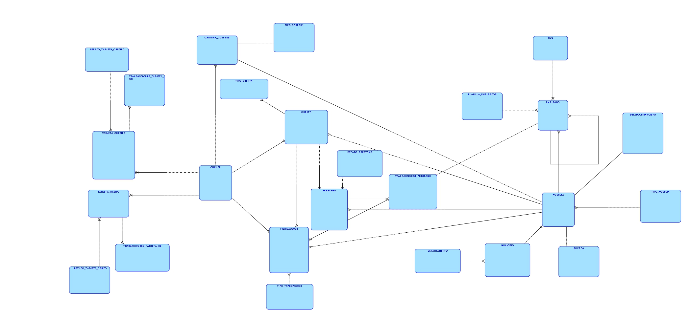
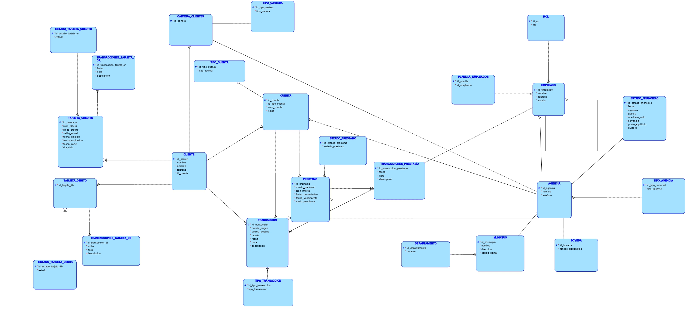
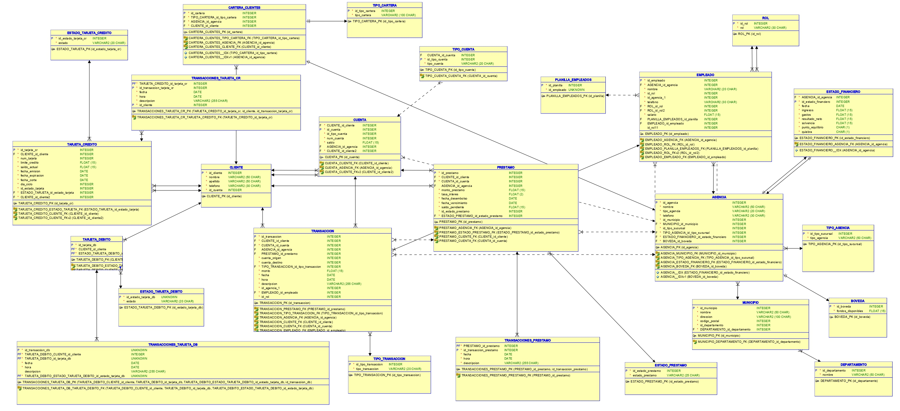

## PROYECTO 2 - SISTEMA BANCARIO JP MORGAN
## GRUPO 9
| Nombre | Carnet  |
|------------|------------|
| Kevin Estuardo Del Cid Quezada | 202103252 | 
| Julio Fernandez | Al rato los pongo xd | 
| Eduardo | ... | 

<br>

## HERRAMIENTAS
- **DATA MODELER:** Para crear el diagrama fisico y logico.
- **SQL:** Para realizar las tablas y los scripts necesarios.
- **Python:** Para realizar un programa que devuelva csv y poblar la base de datos.

<br>

## DATOS DEL PROYECTO
Los siguientes archivos CSV están disponibles para cargar datos en la base de datos:

<details>
    
1. **Clientes** (`clientes_banco_jp_morgan_1m.csv`)
    
    **Campos:**
    
    1. **ID:** Identificador único del cliente.
    2. **Nombre:** Primer nombre del cliente.
    3. **Apellido:** Apellido del cliente.
    4. **Teléfono:** Número de contacto del cliente
2. Cuenta
    1. **Número de Cuenta:** Número de cuenta bancaria del cliente.
    2. **Tipo de Cuenta:** Clasificación del tipo de cuenta bancaria (e.g., corriente, ahorro).
    3. **Saldo:** Monto actual en la cuenta.
3. **Transacciones** (`transacciones_banco_jp_morgan_500k.csv`)
    
    **Campos:**
    
    1. **ID Transacción**: Identificador único de la transacción.
    2. **ID Cliente**: Identificador único del cliente que realizó la transacción.
    3. **Número de Cuenta**: Número de cuenta del cliente.
    4. **Tipo de Transacción**: Tipo de transacción realizada (Depósito, Retiro, Transferencia, Pago).
    5. **Monto**: Monto de la transacción.
    6. **Fecha**: Fecha en que se realizó la transacción.
    7. **Hora**: Hora en que se realizó la transacción.
    8. **Descripción**: Breve descripción de la transacción.
    9. **Sucursal/Agencia**: Sucursal o agencia donde se realizó la transacción.
4. **Préstamos** (`prestamos_banco_jp_morgan_100k.csv`)
    
    **Campos a Incluir:**
    
    1. **ID Préstamo**: Identificador único del préstamo.
    2. **ID Cliente**: Identificador único del cliente que recibió el préstamo.
    3. **Monto del Préstamo**: Monto total del préstamo otorgado.
    4. **Tasa de Interés**: Tasa de interés aplicada al préstamo.
    5. **Fecha de Desembolso**: Fecha en que se desembolsó el préstamo.
    6. **Fecha de Vencimiento**: Fecha en que se debe liquidar el préstamo.
    7. **Saldo Pendiente**: Saldo que aún está pendiente de pago.
    8. **Estado del Préstamo**: Estado actual del préstamo (Activo, Vencido, Cancelado).
5. **Tarjetas de Crédito** (`tarjetas_credito_banco_jp_morgan_100k.csv`)
    
    ### Campos:
    
    1. **ID Tarjeta**: Identificador único de la tarjeta de crédito.
    2. **ID Cliente**: Identificador único del cliente que posee la tarjeta.
    3. **Número de Tarjeta**: Número de la tarjeta de crédito.
    4. **Límite de Crédito**: Límite máximo de crédito asignado a la tarjeta.
    5. **Saldo Actual**: Saldo actual pendiente en la tarjeta.
    6. **Fecha de Emisión**: Fecha en que se emitió la tarjeta.
    7. **Fecha de Expiración**: Fecha en que expira la tarjeta.
    8. **Estado**: Estado actual de la tarjeta (Activa, Bloqueada, Cancelada).
    9. **Fecha de Corte**: La fecha en que se genera el estado de cuenta de la tarjeta de crédito.
    10. **Día del Ciclo**: El día del mes en que se cierra el ciclo de facturación de la tarjeta de crédito (puede variar entre 1 y 31).
6. **Sucursales/Agencias** (`sucursales_agencias_banco_jp_morgan.csv`)
    
    **Campos:**
    
    1. **ID**: Identificador único de la sucursal o agencia.
    2. **Nombre**: Nombre de la sucursal o agencia.
    3. **Tipo**: Especifica si es una sucursal o una agencia.
    4. **Dirección**: Dirección específica de la sucursal o agencia.
    5. **Código Postal**: Código postal del área.
    6. **Teléfono**: Número de contacto de la sucursal o agencia.
7. **Departamento**
    1. **Departamento**: Departamento en el que se encuentra la sucursal o agencia.
    2. **Municipio**: Municipio correspondiente.
8. **Empleados** (`empleados_banco_jp_morgan.csv`)
    
    ### Campos:
    
    1. **ID**: Identificador único del empleado.
    2. **Nombre**: Nombre del empleado.
    3. **Apellido**: Apellido del empleado.
    4. **Rol**: El rol o posición del empleado (Ej. Gerente de Sucursal, Asesor Financiero, Cajero, etc.).
    5. **Departamento**: Departamento al que está asignado el empleado.
    6. **Sucursal/Asignación**: La sucursal o agencia a la que está asignado el empleado.
    7. **Teléfono**: Número de contacto del empleado.
    8. **Fecha de Contratación**: La fecha en que el empleado fue contratado.
    9. **Salario**: El salario del empleado.
    10. **Horario de Trabajo**: Horario en el que el empleado trabaja.
  
 **CONSIDERACIONES NUEVAS PARA EL PROYECTO**

9. **Tabla de Bóvedas**: Esta tabla debe registrar los fondos disponibles en la
bóveda central y en cada sucursal.

10. **Tabla de Transacciones Interbancarias**: Debe registrar todas las
transacciones financieras que ocurren entre el banco central y las sucursales.

11. **Tabla de Estado Financiero**: Esta tabla debe registrar los ingresos y gastos del
banco, calculando su estado financiero, solvencia, y si el banco está en punto
de equilibrio o en quiebra.

  
</details>


<br>

## DIAGRAMAS PARA LA IMPLEMENTACION DE LA BASE DE DATOS:

### DIAGRAMA CONCEPTUAL

Primero empezamos con nuestro diagrama conceptual que nos ayudará a comenzar con una idea de lo que es la base de datos y la estimación de tablas que se requieren para implementar el proyecto.

</img>

### DIAGRAMA LOGICO

Posteriormente procedemos a realizar un diagrama Lógico el cuál nos permite ver los tipo de datos que manejaremos para el proyecto y visualizar la base de datos de mejor manera, cuidando que este normalizada hasta la tercera forma.

</img>

### DIAGRAMA FISICO

Por ultimo se presenta el diagrama fisico, que es el modelo final de nuestra base de datos, este contiene la estructura normalizada a la tercera forma, contiene las identificaciones claras, los tipos de dato a utlizar, especificación de llaves foraneas, etc.

</img>


**NOTA**: El diagrama final esta normalizado a la 3F. 

<br>

## IMPLEMENTACION - SCRIPTS EN ORACLE SQL

Realizamos el archivo sql, que contiene la creación de todas las tablas que hemos obtenido según nuestro modelo final (Fisico). 

### EJEMPLO DE UNA TABLA CREADA:

```
CREATE TABLE agencia (
    id_agencia             INTEGER NOT NULL,
    nombre                 VARCHAR2(50 CHAR) NOT NULL,
    tipo_agencia           VARCHAR2(20 CHAR) NOT NULL,
    telefono               VARCHAR2(30 CHAR) NOT NULL,
    id_municipio           INTEGER NOT NULL,
    id_tipo_sucursal       INTEGER NOT NULL, 
    id_estado_financiero   INTEGER NOT NULL,
    id_boveda              INTEGER NOT NULL,
    fecha_creacion         TIMESTAMP DEFAULT CURRENT_TIMESTAMP NOT NULL,
    fecha_actualizacion    TIMESTAMP DEFAULT CURRENT_TIMESTAMP NOT NULL
);
```
La tabla anterior representa a Agencias el cual contiene TIMESTAMP para manejar fechas, validando que puedan existir valores nulos.

### TRIGGERS PARA LAS SECUENCIAS DE AUTOINCREMENTO

Fue necesario implementar autoincrementos para las claves primarias de las tablas, aqui se deja un ejemplo de como se realiza con una tabla:

```
-- Trigger para agencia
CREATE OR REPLACE TRIGGER agencia_bi_trg
BEFORE INSERT ON agencia
FOR EACH ROW
BEGIN
    SELECT agencia_seq.NEXTVAL INTO :NEW.id_agencia FROM dual;
END;
/
```

## POBLAR NUESTRA BASE DE DATOS

Para poder poblar nuestra base de datos con precisamente eso (datos) necesitamos crear diversos archivos csv, que serán leídos y almacenados en cada una de las tablas que se tienen en el modelo y de esta manera estar listos para realizar consultas básicas y avanzadas, completando la simulación de un banco.

### EJEMPLO DE UN ARCHIVO QUE PERMITE LA CREACION DE UN ARCHIVO CSV CON LOS PARAMETROS REQUERIDOS Y LA CANTIDAD NECESITADA DE DATOS.

```
import pandas as pd
import random
from datetime import datetime

def generate_agencia(n):
    agencia_data = {
        "id_agencia": [],
        "nombre": [],
        "tipo_agencia": [],
        "telefono": [],
        "id_municipio": [],
        "id_tipo_sucursal": [],
        "id_estado_financiero": [],
        "id_boveda": [],
        "fecha_creacion": [],
        "fecha_actualizacion": []
    }

    tipos_agencia = ["Oficina", "Sucursal", "Agencia"]

    for i in range(n):
        id_agencia = i + 1  # Iniciar desde 1
        agencia_data["id_agencia"].append(id_agencia)
        agencia_data["nombre"].append(f"Agencia {id_agencia}")  # Cambiar el nombre
        agencia_data["tipo_agencia"].append(random.choice(tipos_agencia))
        agencia_data["telefono"].append(f"123456{id_agencia}")  # Teléfono modificado
        agencia_data["id_municipio"].append(random.randint(1, 340))  # ID de municipio limitado entre 1 y 340
        agencia_data["id_tipo_sucursal"].append(random.randint(1, 2))  # ID de tipo sucursal limitado entre 1 y 2
        agencia_data["id_estado_financiero"].append(id_agencia)  # ID de estado financiero igual a id_agencia
        agencia_data["id_boveda"].append(id_agencia)  # ID de boveda igual a id_agencia
        agencia_data["fecha_creacion"].append(datetime.now())
        agencia_data["fecha_actualizacion"].append(datetime.now())

    pd.DataFrame(agencia_data).to_csv("agencia.csv", index=False)
    print("CSV generado para la tabla agencia.")

if __name__ == "__main__":
    n = int(input("¿Cuántos registros deseas generar para la tabla agencia? "))
    generate_agencia(n)
```

**NOTA** Cada tabla tiene su respectivo script en python que se encarga de realizar los datos. Para fines del proyecto y evitar problemas en la base de datos, se ha verificado que los datos tengan una logica para que se relacionen correctamente.


<br>

## CONSULTAS

### CONSULTAS BASICAS

Se han realizado consultas básicas para verificar el correcto funcionamiento de la base de datos

### Obtener todos los clientes
# Consultas simples

### Obtener todos los clientes
```sql
    SELECT * FROM cliente;
```

### Contar el numero de agencias
```sql
    SELECT COUNT(*) AS total_agencias FROM agencia;
```

### Obtener los nombres de todos los empleados
```sql
    SELECT nombre FROM empleado;
```

### Obtener el saldo total de de todas las cuentas
```sql
    SELECT SUM(saldo) AS total_saldo FROM cuenta;
```

### Listar todos los estados de los prestamos
```sql
    SELECT * FROM estado_prestamo;
```
---
<br>

# CONSULTAS AVANZADAS
Las consultas avanzadas se encargan de comprobar de una manera más especifica el correcto funcionamiento de la base de datos.

### Obtener la información de los préstamos junto con el nombre del cliente
```sql
    SELECT p.id_prestamo, p.monto_prestamo, c.nombre, c.apellido
    FROM prestamo p
    JOIN cliente c ON p.id_cliente = c.id_cliente;
```

### Listar todas las transacciones junto con la información del cliente y el tipo de transacción
```sql
    SELECT t.id_transaccion, t.monto, c.nombre, c.apellido, tt.tipo_transaccion
    FROM transaccion t
    JOIN cliente c ON t.id_cliente = c.id_cliente
    JOIN tipo_transaccion tt ON t.id_tipo_transaccion = tt.id_tipo_transaccion;
```

### Obtener el saldo de las cuentas junto con el nombre de la agencia
```sql
    SELECT c.num_cuenta, c.saldo, a.nombre AS nombre_agencia
    FROM cuenta c
    JOIN agencia a ON c.id_agencia = a.id_agencia;
```

### Listar todos los empleados junto con el nombre de su supervisor
```sql
    SELECT e.nombre AS empleado, es.nombre AS supervisor
    FROM empleado e
    LEFT JOIN empleado es ON e.id_empleado_sup = es.id_empleado;
```

### Obtener el estado financiero de cada agencia con su nombre
```sql
    SELECT a.nombre AS nombre_agencia, ef.ingresos, ef.gastos, ef.resultado_neto
    FROM estado_financiero ef
    JOIN agencia a ON ef.id_agencia = a.id_agencia;
```


<br>


